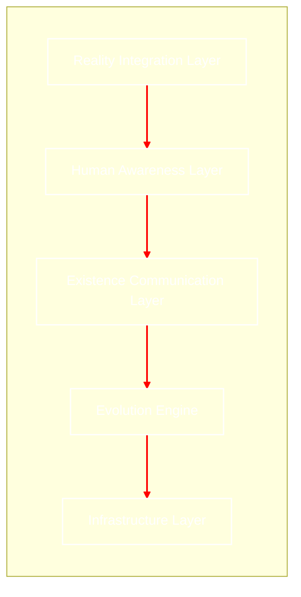

# Living-Bio-Network
## เอกสารสถาปัตยกรรมระบบ(Architecture Specification)v1.0

# 1. บทนำ(Overview)
#### Living Bio Network คือการปฏิวัติโครงสร้างพื้นฐานดิจิทัลจากการใช้โลหะและซิลิกอน ไปสู่ "ชีวเครือข่ายที่มีสภาพจิตสำนึกในเชิงชีวภาพ" โดยใช้สายใยรา (Mycelium) และแบคทีเรียดัดแปลงพันธุกรรมเป็นตัวกลางในการส่งสัญญาณ เครือข่ายนี้ไม่ได้ถูกสร้างขึ้นเพื่อ "ติดตั้ง" แต่ถูกสร้างขึ้นเพื่อ "ปลูกและเติบโต" ในสภาพแวดล้อมจริง


# 2. วิสัยทัศน์(Vision)
#### มุ่งสร้างเครือข่ายที่ไม่สร้างขยะอิเล็กทรอนิกส์ แต่เป็นส่วนหนึ่งของระบบนิเวศ (Symbiotic Internet) ที่สามารถเยียวยาตัวเองได้ (Self-healing) ขยายตัวได้เอง (Self-expanding) และใช้พลังงานจากกระบวนการย่อยสลายสารอินทรีย์ เพื่อรองรับการสื่อสารระดับโมเลกุลในอนาคต


# 3. ภาพรวมระบบแบบ Graph Algorithm
#### นระบบนี้ จะมอง Node และ Edge ผ่านทฤษฎีกราฟที่ปรับแต่งด้วยกฎทางชีววิทยา:



# 4. องค์ประกอบหลัก (Core Components)
## 4.1 Infrastructure Layer (ชั้นโครงสร้างพื้นฐาน)

#### 
Substrate: ชั้นฐานสารอินทรีย์ที่บรรจุสารอาหารเพื่อให้สายใยราเติบโต

Bio-Sensors: เซ็นเซอร์ชีวภาพที่ตรวจจับการเปลี่ยนแปลงทางเคมีเพื่อแปลงเป็นสัญญาณดิจิทัล
```
class BioInfrastructure:
    def __init__(self):
        self.substrate = "Organic Nutrient Mix"
        self.active_sensors = []

    def convert_chemical_to_digital(self, chemical_signal):
        # แปลงการเปลี่ยนแปลงทางเคมีเป็นสัญญาณ 0, 1
        return digital_payload
```

## 4.2 Evolution Engine (กลไกการวิวัฒนาการ)
#### 
Genetic Iteration: ระบบจะมีการ "Update Firmware" ผ่านการส่งโปรตีนหรือตัดต่อยีนในแบคทีเรีย เพื่อเพิ่มประสิทธิภาพการรับส่งข้อมูลตามสภาพแวดล้อมที่เปลี่ยนไป

Adaptive Growth: หากเส้นทางใดถูกทำลาย ระบบจะกระตุ้นการหลั่งฮอร์โมนเพื่อเร่งการเติบโตของสายใยเส้นใหม่
```
def evolve_network(network_state):
    for route in network_state.routes:
        # หากประสิทธิภาพต่ำกว่าเกณฑ์ ให้ทำลายเส้นทางเดิม
        if route.efficiency < THRESHOLD:
            network_state.remove_edge(route)
            
    # หากมีการใช้งานหนาแน่น ให้งอกสายใยราเส้นทางใหม่
    if network_state.traffic_density > OPTIMAL_LEVEL:
        network_state.spawn_new_path()
        
    return network_state
```
## 4.3 Existence Communication Layer (ชั้นการสื่อสารแห่งการดำรงอยู่)
#### 
Signal Modality: ใช้การแพร่ของสารเคมี (Chemical Diffusion) และการส่งประจุไฟฟ้าผ่านเยื่อหุ้มเซลล์ (Action Potential)

Molecular Protocol: โปรโตคอลการจัดเก็บและส่งข้อมูลผ่านลำดับเบส DNA สำหรับการสื่อสารความจุสูงในระยะยาว
```
interface ExistencePacket {
    entityId: string;           // รหัสประจำตัวของสิ่งมีชีวิต
    chemicalSignal: string;    // สัญญาณสารเคมี (Signal Modality)
    dnaSequence: string;       // ชุดข้อมูล DNA สำหรับความจุสูง
    timestamp: number;         // Unix epoch time
}
```
## 4.4 Structural Privacy (ความเป็นส่วนตัวเชิงโครงสร้าง)
#### 
Biological Encryption: ข้อมูลจะถูกเข้ารหัสด้วยรหัสพันธุกรรม (Genetic Key) ซึ่งมีเพียง Node ปลายทางที่มียีนเข้าคู่กันเท่านั้นที่จะสามารถถอดรหัส (Express) ข้อมูลออกมาได้
```
const biologicalEncryption = {
    encrypt: (data, geneticKey) => {
        // เข้ารหัสข้อมูลด้วยลำดับเบส DNA
        return `DNA::${geneticKey}::${data}`;
    },
    decrypt: (packet, receiverKey) => {
        // ตรวจสอบว่า Key พันธุกรรมตรงกันหรือไม่
        return (packet.key === receiverKey) ? packet.data : "Access Denied";
    }
};
```
## 4.5 Human Awareness Reality Integration (การผสานรวมความตระหนักรู้ของมนุษย์)
#### 
Biometric Interface: การเชื่อมต่อระหว่างมนุษย์กับเครือข่ายผ่านการสัมผัสหรือการแลกเปลี่ยนสารคัดหลั่ง (เช่น เหงื่อ) เพื่อส่งผ่านข้อมูลหรือความรู้สึก

Eco-Feedback: มนุษย์จะรับรู้สถานะของเครือข่ายผ่านสัญญาณทางธรรมชาติ เช่น การเปลี่ยนสีของเห็ดรา หรือการเรืองแสง (Bioluminescence) เมื่อมีการใช้งานหนาแน่น
```
def update_eco_feedback(network_load):
    # แสดงสถานะผ่านการเรืองแสง (Bioluminescence)
    if network_load > 0.8:
        return "Bioluminescence: Intense Blue (High Traffic)"
    else:
        return "Bioluminescence: Soft Green (Idle)"
```


