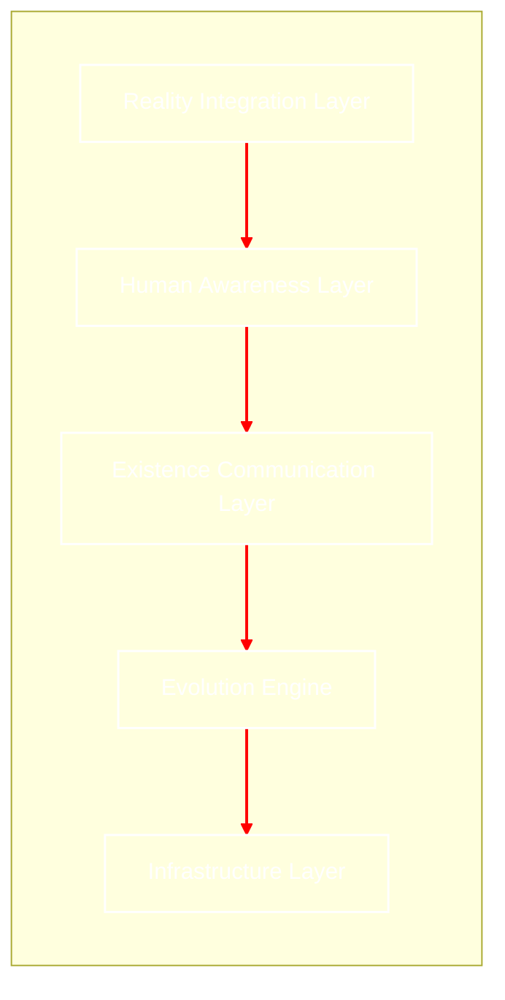

# Living-Bio-Network
## เอกสารสถาปัตยกรรมระบบ (Architecture Specification) v1.0

**Version:** 1.0
**Sprint:** Alpha
**รายวิชา:** CP352005 Networks

---

## ทีมและหน้าที่รับผิดชอบ (Role Assignment)

| ชื่อ | รหัสนักศึกษา | บทบาท | รับผิดชอบ Layer |
|:---|:---:|:---|:---|
| นางสาวกวินธิดา อนุนิวัฒน์ | 673380390-5 | Product Owner | Human Awareness Layer |
| นายภควัฒน์ สุขมณี | 673380418-9 | System Architect | ภาพรวมทุก Layer + Existence Communication |
| นางสาวกัญญาวีร์ สิงห์ลี | 673380573-7 | QA | ทดสอบทุก Layer |
| นายณัฏฐชัย ผลดี | 673380581-8 | Backend Engineer | Infrastructure + Evolution Engine |
| นายธนนันต์ สาวิกัน | 673380586-8 | Scrum Master | Documentation + Structural Privacy |

---

# 1. บทนำ (Overview)

Living Bio Network คือการปฏิวัติโครงสร้างพื้นฐานดิจิทัลจากการใช้โลหะและซิลิกอน ไปสู่ "ชีวเครือข่ายที่มีสภาพจิตสำนึกในเชิงชีวภาพ" โดยใช้สายใยรา (Mycelium) และแบคทีเรียดัดแปลงพันธุกรรมเป็นตัวกลางในการส่งสัญญาณ เครือข่ายนี้ไม่ได้ถูกสร้างขึ้นเพื่อ "ติดตั้ง" แต่ถูกสร้างขึ้นเพื่อ "ปลูกและเติบโต" ในสภาพแวดล้อมจริง

---

# 2. วิสัยทัศน์ (Vision)

มุ่งสร้างเครือข่ายที่ไม่สร้างขยะอิเล็กทรอนิกส์ แต่เป็นส่วนหนึ่งของระบบนิเวศ (Symbiotic Internet) ที่สามารถเยียวยาตัวเองได้ (Self-healing) ขยายตัวได้เอง (Self-expanding) และใช้พลังงานจากกระบวนการย่อยสลายสารอินทรีย์ เพื่อรองรับการสื่อสารระดับโมเลกุลในอนาคต

---

# 3. ภาพรวมระบบ (System Overview)

ระบบมอง Node และ Edge ผ่านทฤษฎีกราฟที่ปรับแต่งด้วยกฎทางชีววิทยา โดยนิยามเครือข่ายเป็น G = (V, E) ที่ V คือ Biological Node และ E คือ Bio-Fiber Connection



---

# 4. ผลการทบทวนสถาปัตยกรรม (Architectural Review)

## 4.1 สรุปผลการตรวจแต่ละ Layer

| Layer | เจ้าของ | ผลการตรวจ | หมายเหตุ |
|:---|:---|:---:|:---|
| Infrastructure Layer | ณัฏฐชัย | ผ่าน | BioNode และ Bio-Sensor ออกแบบชัดเจน พร้อมพัฒนา |
| Evolution Engine | ณัฏฐชัย | ผ่านมีเงื่อนไข | ต้องกำหนดค่า THRESHOLD และ OPTIMAL_LEVEL ก่อนเริ่ม Sprint Beta |
| Existence Communication Layer | ภควัฒน์ | ผ่าน | ExistencePacket Schema ครบถ้วน ใช้งานได้เลย |
| Structural Privacy Layer | ธนนันต์ | ผ่าน | Genetic Key Encryption ออกแบบดี ปลอดภัยในระดับโครงสร้าง |
| Human Awareness Layer | กวินธิดา | ผ่านมีเงื่อนไข | Biometric Interface ต้องระบุรายละเอียดให้ชัดเจนขึ้น |

## 4.2 สิ่งที่ต้องแก้ไขก่อนเริ่ม Sprint Beta

1. **Evolution Engine** — กำหนดค่า `THRESHOLD` สำหรับตัดสินว่า Route Efficiency ต่ำแค่ไหนถึงจะตัดเส้นทาง
2. **Evolution Engine** — กำหนดค่า `OPTIMAL_LEVEL` สำหรับตัดสินว่า Traffic หนาแน่นเกินไปแล้วหรือยัง
3. **Human Awareness Layer** — ออกแบบ Biometric Interface ให้ละเอียดขึ้นว่ารับข้อมูลจากมนุษย์ผ่านช่องทางไหนบ้าง

**กำหนดเสร็จ:** ก่อนสิ้นสุด Sprint Alpha (Day 14)

## 4.3 การตัดสินใจสำคัญ

| การตัดสินใจ | เหตุผล | ผู้อนุมัติ | สถานะ |
|:---|:---|:---|:---:|
| ใช้ Python ในการพัฒนา | ทีมคุ้นเคย พัฒนาได้เร็ว รองรับ Graph ได้ดี | ภควัฒน์ | |
| ใช้ Greedy Algorithm ใน Sprint Alpha | ง่ายกว่า ค่อยพัฒนาเป็น Dijkstra ใน Sprint Beta | ภควัฒน์ | |
| ใช้ String Matching สำหรับ Genetic Key ก่อน | ทำง่าย ค่อยซับซ้อนขึ้นใน Sprint Delta | ภควัฒน์ | |
| จำลอง Mycelium ด้วย Graph แทนสิ่งมีชีวิตจริง | เป็นโปรเจคเชิงแนวคิด ไม่ใช้สิ่งมีชีวิตจริง | กวินธิดา | |

---

# 5. องค์ประกอบหลัก (Core Components)

## 5.1 Infrastructure Layer (ชั้นโครงสร้างพื้นฐาน)

**เจ้าของ:** ณัฏฐชัย | **สถานะ:** ผ่าน

**Substrate:** ชั้นฐานสารอินทรีย์ที่บรรจุสารอาหารเพื่อให้สายใยราเติบโต

**Bio-Sensors:** เซ็นเซอร์ชีวภาพที่ตรวจจับการเปลี่ยนแปลงทางเคมีเพื่อแปลงเป็นสัญญาณดิจิทัล

```python
class BioInfrastructure:
 def __init__(self):
 self.substrate = "Organic Nutrient Mix"
 self.active_sensors = []

 def convert_chemical_to_digital(self, chemical_signal):
 # แปลงการเปลี่ยนแปลงทางเคมีเป็นสัญญาณ 0, 1
 return digital_payload
```

**ความเสี่ยง:** ต่ำ — โครงสร้างชัดเจน พร้อมพัฒนาใน Sprint Alpha

---

## 5.2 Evolution Engine (กลไกการวิวัฒนาการ)

**เจ้าของ:** ณัฏฐชัย | **สถานะ:** ผ่านมีเงื่อนไข

**Genetic Iteration:** ระบบจะมีการ "Update Firmware" ผ่านการส่งโปรตีนหรือตัดต่อยีนในแบคทีเรีย เพื่อเพิ่มประสิทธิภาพการรับส่งข้อมูลตามสภาพแวดล้อมที่เปลี่ยนไป

**Adaptive Growth:** หากเส้นทางใดถูกทำลาย ระบบจะกระตุ้นการหลั่งฮอร์โมนเพื่อเร่งการเติบโตของสายใยเส้นใหม่

```python
def evolve_network(network_state):
 for route in network_state.routes:
 # หากประสิทธิภาพต่ำกว่าเกณฑ์ ให้ทำลายเส้นทางเดิม
 if route.efficiency < THRESHOLD:
 network_state.remove_edge(route)

 # หากมีการใช้งานหนาแน่น ให้งอกสายใยราเส้นทางใหม่
 if network_state.traffic_density > OPTIMAL_LEVEL:
 network_state.spawn_new_path()

 return network_state
```

**เงื่อนไขที่ต้องแก้:** กำหนดค่า `THRESHOLD` และ `OPTIMAL_LEVEL` ก่อนสิ้นสุด Sprint Alpha

---

## 5.3 Existence Communication Layer (ชั้นการสื่อสารแห่งการดำรงอยู่)

**เจ้าของ:** ภควัฒน์ + ณัฏฐชัย | **สถานะ:** ผ่าน

**Signal Modality:** ใช้การแพร่ของสารเคมี (Chemical Diffusion) และการส่งประจุไฟฟ้าผ่านเยื่อหุ้มเซลล์ (Action Potential)

**Molecular Protocol:** โปรโตคอลการจัดเก็บและส่งข้อมูลผ่านลำดับเบส DNA สำหรับการสื่อสารความจุสูงในระยะยาว

```
interface ExistencePacket {
 entityId: string; // รหัสประจำตัวของสิ่งมีชีวิต
 chemicalSignal: string; // สัญญาณสารเคมี
 dnaSequence: string; // ชุดข้อมูล DNA สำหรับความจุสูง
 timestamp: number; // Unix epoch time
}
```

---

## 5.4 Structural Privacy (ความเป็นส่วนตัวเชิงโครงสร้าง)

**เจ้าของ:** ธนนันต์ + ภควัฒน์ | **สถานะ:** ผ่าน

**Biological Encryption:** ข้อมูลจะถูกเข้ารหัสด้วยรหัสพันธุกรรม (Genetic Key) ซึ่งมีเพียง Node ปลายทางที่มียีนเข้าคู่กันเท่านั้นที่จะสามารถถอดรหัส (Express) ข้อมูลออกมาได้

```javascript
const biologicalEncryption = {
 encrypt: (data, geneticKey) => {
 return `DNA::${geneticKey}::${data}`;
 },
 decrypt: (packet, receiverKey) => {
 return (packet.key === receiverKey) ? packet.data : "Access Denied";
 }
};
```

---

## 5.5 Human Awareness Reality Integration (การผสานรวมความตระหนักรู้ของมนุษย์)

**เจ้าของ:** กวินธิดา + ภควัฒน์ | **สถานะ:** ผ่านมีเงื่อนไข

**Biometric Interface:** การเชื่อมต่อระหว่างมนุษย์กับเครือข่ายผ่านการสัมผัสหรือการแลกเปลี่ยนสารคัดหลั่ง เพื่อส่งผ่านข้อมูลหรือความรู้สึก

**Eco-Feedback:** มนุษย์จะรับรู้สถานะของเครือข่ายผ่านสัญญาณทางธรรมชาติ เช่น การเรืองแสง (Bioluminescence) เมื่อมีการใช้งานหนาแน่น

```python
def update_eco_feedback(network_load):
 if network_load > 0.8:
 return "Bioluminescence: Intense Blue (High Traffic)"
 else:
 return "Bioluminescence: Soft Green (Idle)"
```

**เงื่อนไขที่ต้องแก้:** ระบุรายละเอียด Biometric Interface ว่ารับข้อมูลจากมนุษย์ผ่านช่องทางไหนบ้าง

---

# 6. โปรโตคอลการสื่อสาร (Communication Protocol)

- **Chemical Signal Multiplexing:** การส่งสัญญาณสารเคมีหลายประเภทพร้อมกันผ่านสายใยเดียว โดยใช้ความเข้มข้นที่ต่างกันเพื่อระบุรหัสข้อมูล
- **Threshold-Based Propagation:** ข้อมูลจะถูกส่งต่อก็ต่อเมื่อประจุไฟฟ้าชีวภาพ (Action Potential) ถึงระดับที่กำหนด เพื่อป้องกันสัญญาณรบกวน (Noise)
- **Bi-directional Data Flow:** เครือข่ายรองรับการสื่อสารสองทาง ทั้งจากรากสู่ปลายยอด และจากปลายยอดกลับสู่ราก

---

# 7. ข้อกำหนดที่ไม่ใช่เชิงหน้าที่ (Non-Functional Requirements)

- **Reliability:** ระบบต้องกู้คืนเส้นทางได้เอง (Self-healing) ภายใน 24 ชั่วโมงหากเกิดความเสียหาย
- **Sustainability:** เครือข่ายต้องดำรงอยู่ได้ด้วยพลังงานจากขยะอินทรีย์ 100%
- **Biological Safety:** สารพันธุกรรมและแบคทีเรียต้องถูกควบคุมไม่ให้แพร่กระจายสู่ภายนอก (Bio-containment)

---

# 8. กรณีการใช้งาน (Use Cases)

- **Smart Forest Monitoring:** ตรวจจับไฟป่าหรือความชื้นในดินโดยส่งสัญญาณผ่านรากไม้ในพื้นที่ห่างไกล
- **Subterranean Secure Network:** ระบบสื่อสารใต้ดินที่ตรวจจับได้ยากด้วยคลื่นวิทยุ เหมาะสำหรับข้อมูลความลับสูง
- **Organic Smart City:** เชื่อมต่อเซ็นเซอร์ในอาคารสีเขียวที่ใช้พืชเป็นตัวนำสัญญาณและฟอกอากาศไปพร้อมกัน

---

# 9. ข้อจำกัดทางเทคโนโลยี (Technical Limitations)

- **Latency:** ความเร็วในการส่งข้อมูลต่ำกว่า Fiber Optic เนื่องจากต้องรอการแพร่กระจายของสารเคมี
- **Environmental Sensitivity:** ประสิทธิภาพขึ้นอยู่กับอุณหภูมิและความชื้น
- **Signal Decay:** สัญญาณจางหายตามระยะทาง จำเป็นต้องมี Node แบคทีเรียเป็นตัวทวนสัญญาณ (Repeater)

---

# 10. การขยายในอนาคต (Future Scalability)

- **Interspecies Connectivity:** พัฒนาโปรโตคอลให้เชื่อมต่อกับเครือข่ายประสาทของสิ่งมีชีวิตสายพันธุ์อื่นได้
- **Global Mycelium Web:** ขยายเครือข่ายระดับทวีปโดยใช้ระบบรากของป่าธรรมชาติเป็นโครงสร้างหลัก
- **Bio-Quantum Computing:** ใช้สถานะของโปรตีนในเซลล์เพื่อประมวลผลข้อมูลแบบ Quantum ชีวภาพ

---

# 11. สรุป (Conclusion)

Living Bio Network (LBN) ไม่ใช่แค่ทางเลือกใหม่ของการสื่อสาร แต่เป็นวิวัฒนาการที่ผสานเทคโนโลยีเข้ากับธรรมชาติอย่างสมบูรณ์ ระบบนี้มอบความยั่งยืนและความปลอดภัยเชิงโครงสร้างที่เทคโนโลยีดิจิทัลแบบเดิมทำไม่ได้ แม้จะมีข้อจำกัดเรื่องความเร็ว แต่ความสามารถในการปรับตัวและซ่อมแซมตัวเองทำให้มันเป็นรากฐานสำคัญของเทคโนโลยีสีเขียวในอนาคต

---

## ลายเซ็นอนุมัติ

| ชื่อ | บทบาท | วันที่ |
|:---|:---|:---:|
| นางสาวกวินธิดา อนุนิวัฒน์ | Product Owner | |
| นายภควัฒน์ สุขมณี | System Architect | |
| นางสาวกัญญาวีร์ สิงห์ลี | QA | |
| นายณัฏฐชัย ผลดี | Backend Engineer | |
| นายธนนันต์ สาวิกัน | Scrum Master | |

---

*Living-Bio-Network Architecture Specification v1.0 — CP352005 Networks*
