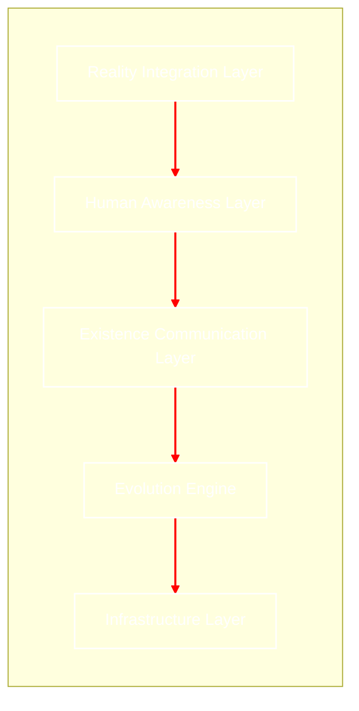

# Living-Bio-Network
## เอกสารสถาปัตยกรรมระบบ(Architecture Specification)v1.0

# บทนำ(Overview)
#### Living Bio Network คือการปฏิวัติโครงสร้างพื้นฐานดิจิทัลจากการใช้โลหะและซิลิกอน ไปสู่ "ชีวเครือข่ายที่มีสภาพจิตสำนึกในเชิงชีวภาพ" โดยใช้สายใยรา (Mycelium) และแบคทีเรียดัดแปลงพันธุกรรมเป็นตัวกลางในการส่งสัญญาณ เครือข่ายนี้ไม่ได้ถูกสร้างขึ้นเพื่อ "ติดตั้ง" แต่ถูกสร้างขึ้นเพื่อ "ปลูกและเติบโต" ในสภาพแวดล้อมจริง

# วิสัยทัศน์(Vision)
#### มุ่งสร้างเครือข่ายที่ไม่สร้างขยะอิเล็กทรอนิกส์ แต่เป็นส่วนหนึ่งของระบบนิเวศ (Symbiotic Internet) ที่สามารถเยียวยาตัวเองได้ (Self-healing) ขยายตัวได้เอง (Self-expanding) และใช้พลังงานจากกระบวนการย่อยสลายสารอินทรีย์ เพื่อรองรับการสื่อสารระดับโมเลกุลในอนาคต

# ภาพรวมระบบแบบ Graph Algorithm
#### นระบบนี้ จะมอง Node และ Edge ผ่านทฤษฎีกราฟที่ปรับแต่งด้วยกฎทางชีววิทยา:

## 1. ส่วนพลังงาน (Organic Waste & Energy)

#### Waste → Bio-Router: เปรียบเสมือนการเสียบปลั๊กไฟ แต่แทนที่จะใช้ไฟฟ้า เราใช้ "ขยะอินทรีย์" (เศษอาหาร, ใบไม้เน่า) มาป้อนเป็นสารอาหารให้กับแบคทีเรียและรา เพื่อให้ระบบมีพลังงานในการส่งสัญญาณและเติบโตได้โดยไม่ต้องพึ่งพาโรงไฟฟ้า

## 2. ส่วนโครงสร้างเครือข่าย (Infrastructure Layer)

#### 
- Bio-Router (Bacteria Hub): ทำหน้าที่เหมือน Router Wi-Fi ตามบ้าน แต่เป็นกลุ่มของแบคทีเรียที่คอยรับ-ส่งสัญญาณข้อมูล
- Mycelial Edge (สายใยรา): คือ "สาย LAN ที่มีชีวิต" เชื่อมระหว่าง Hub
* Shortest Path: ราจะเลือกทางที่ใกล้ที่สุดเพื่อส่งข้อมูลให้เร็ว (เหมือน Google Maps เลือกเส้นทาง)
* Self-Healing: ถ้าสายใยขาด ระบบจะสั่งให้รา "งอกใหม่" ไปหา Hub อื่นเองเพื่อไม่ให้เน็ตหลุด

## 3. ส่วนสมองและการควบคุม (Evolution Engine)

#### 
* Physarum Algorithm → Bio-Router: คือระบบการตัดสินใจ เครือข่ายจะคำนวณตลอดเวลาว่า "ตอนนี้ควรจะงอกไปทางไหน?" โดยใช้สัญชาตญาณของราเมือกที่เก่งเรื่องการหาเส้นทางที่คุ้มค่าที่สุด

* Genetic Firmware Update → Bio-Router: ปกติคอมพิวเตอร์ต้องกด Update Windows แต่ใน Living Bio Network เราจะส่ง "ยีนใหม่" ไปให้แบคทีเรีย เพื่อให้มันฉลาดขึ้นหรือส่งข้อมูลได้แรงขึ้น เรียกว่าการอัปเกรดผ่านพันธุกรรม

## 4. ข้อมูลที่วิ่งในระบบ (Data Packet)

* Signal (DNA/Molecular): ข้อมูลที่ส่งไม่ใช่แค่ 0 กับ 1 ของไฟฟ้า แต่เป็น "รหัสพันธุกรรม" หรือ "สารเคมี" ที่วิ่งไปตามสายใยรา เมื่อไปถึงจุดหมาย แบคทีเรียปลายทางจะ "อ่าน" รหัสนั้นออกมาเป็นข้อมูล
